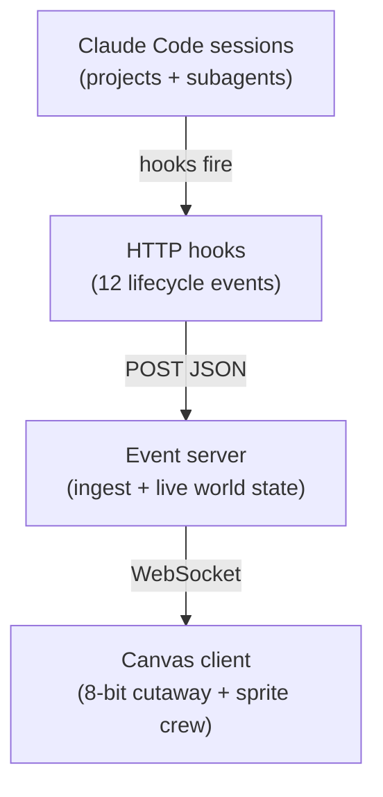
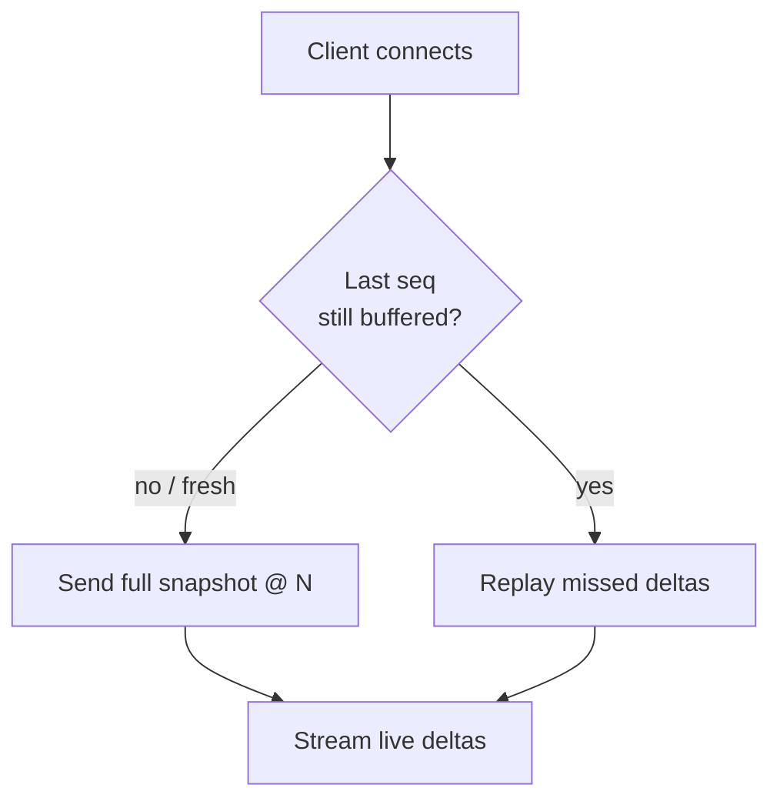

# Real-Time Agent Visualization — Implementation Spec (8-bit Death Star, cutaway + moving crew)

A live visualization of Claude Code agents working across projects, rendered as an **8-bit pixel-art cutaway side view of a Death Star** (à la the LEGO UCS cutaway: a sphere sliced open to reveal stacked interior decks of rooms). The camera is a single fixed frame — no navigation, no view movement — but the **crew characters move**: each agent is a small Imperial sprite — stormtrooper, officer, or gunner — that walks the decks and performs task animations at consoles. Subagents appear as droids (astromech, protocol, mouse). The superlaser dish fires a beam off-frame and its lens reflects fleet-wide activity. Everything is driven in real time by Claude Code hook events.

This document is an implementation hand-off. It specifies the architecture, data contracts, and build order. It deliberately does **not** contain application source — that's the implementer's job. Code blocks below are *contracts and configuration* (hook config, message shapes), not the program itself.

---

## 1. Key decisions (read first)

- **Local-first, single user.** Everything runs on the developer's machine. No auth, no cloud, no multi-tenant concerns.
- **2D canvas, NOT three.js.** This was a three.js design in earlier revisions. A fixed, static, side-on, 8-bit view has no camera, no depth, and no 3D geometry, so WebGL/three.js is the wrong tool — it adds weight and complexity for nothing. Render with the **HTML5 Canvas 2D API** (draw chunky pixels with `fillRect`, or draw to a small offscreen canvas and upscale with `imageSmoothingEnabled = false` for crisp nearest-neighbor scaling). A CSS sprite grid is an even simpler alternative. (If there is some external reason to keep three.js, it *can* render a flat orthographic quad — but don't; it's overkill here.)
- **Fixed camera, moving sprites.** One composition, centered, no pan/zoom/scene-graph. The *view* never moves — but the crew sprites do: they walk the decks and animate at consoles. This means a continuous animation loop (see below), unlike the earlier static-frame revisions.
- **8-bit aesthetic = deliberate simplicity.** Low internal resolution (logical grid ~165×130 blocks, each drawn as a small `fillRect`); a tight fixed palette (~8–10 colors); flat color blocks with 2–3 shading bands instead of smooth gradients. `imageSmoothingEnabled = false` + CSS `image-rendering: pixelated`. No bloom, no glow, no anti-aliasing. Animation is frame-based sprite work (2–4 frame walk cycles, simple arm-bob for tasks) — not smooth tweening or particle systems.
- **Movement adds an animation layer (scope note).** Earlier revisions were a static frame that repainted only on events. "Characters moving" reintroduces a real-time sprite engine: a `requestAnimationFrame` loop, per-sprite position + walk-cycle state, and pathing along decks. Still far lighter than 3D (2D canvas sprites are well-trodden), but no longer trivial — budget for it.
- **The visualization must never slow down Claude Code.** Hooks fire synchronously and can block the agent. Every hook is fire-and-forget: the server accepts the POST and returns immediately (HTTP 202), doing all real work asynchronously.
- **State is authoritative on the server.** The browser is a stateless view. Current world state is a reduction over the event stream, held server-side. Reconnects, refreshes, and multiple monitors all become the same cheap operation.
- **Suggested stack:** Node.js for the event server (Express/Fastify + `ws`); a single static HTML page with a `<canvas>` and a small render loop for the client. Python (FastAPI + websockets) is fine for the server.

---

## 2. Architecture



| Component | Responsibility |
|---|---|
| Claude Code hooks | Emit a JSON event on each lifecycle point, POSTed to the local server. Config only. |
| Event server | Ingest events, fold them into an authoritative world model, broadcast snapshots + deltas over WebSocket. |
| Canvas client | Subscribe to the stream, map state to sprite behavior (walk to console, play task animation, spawn droid), run the animation loop. |

> The data layer (sections 3–4) is unchanged from earlier revisions and is independent of the visual theme. Only the client (sections 5–7) changed: a 2D canvas sprite renderer with a cutaway-rooms layout and moving crew.

---

## 3. Phase 1 — Data layer (hooks)

Configure hooks at the **user level** (`~/.claude/settings.json`) so every session in every project emits. Use the **HTTP handler**, which POSTs the event's JSON payload directly to a URL — no shell scripts required.

Register one HTTP hook per event type, all pointing at a single ingest endpoint. The server differentiates events by the event-name field in the payload.

```json
{
  "hooks": {
    "SessionStart":       [{ "hooks": [{ "type": "http", "url": "http://localhost:8080/ingest", "timeout": 5 }] }],
    "SessionEnd":         [{ "hooks": [{ "type": "http", "url": "http://localhost:8080/ingest", "timeout": 5 }] }],
    "UserPromptSubmit":   [{ "hooks": [{ "type": "http", "url": "http://localhost:8080/ingest", "timeout": 5 }] }],
    "PreToolUse":         [{ "matcher": "*", "hooks": [{ "type": "http", "url": "http://localhost:8080/ingest", "timeout": 5 }] }],
    "PostToolUse":        [{ "matcher": "*", "hooks": [{ "type": "http", "url": "http://localhost:8080/ingest", "timeout": 5 }] }],
    "PostToolUseFailure": [{ "matcher": "*", "hooks": [{ "type": "http", "url": "http://localhost:8080/ingest", "timeout": 5 }] }],
    "SubagentStart":      [{ "hooks": [{ "type": "http", "url": "http://localhost:8080/ingest", "timeout": 5 }] }],
    "SubagentStop":       [{ "hooks": [{ "type": "http", "url": "http://localhost:8080/ingest", "timeout": 5 }] }],
    "Notification":       [{ "hooks": [{ "type": "http", "url": "http://localhost:8080/ingest", "timeout": 5 }] }],
    "Stop":               [{ "hooks": [{ "type": "http", "url": "http://localhost:8080/ingest", "timeout": 5 }] }]
  }
}
```

**Events consumed and what they mean (8-bit mapping):**

| Event | Carries (event-specific) | Meaning in the viz |
|---|---|---|
| `SessionStart` | `source` | A crew sprite spawns and walks onto its project's deck |
| `SessionEnd` | `reason` | Sprite walks off / despawns |
| `UserPromptSubmit` | `prompt` | Sprite turns toward a console ("receiving orders") |
| `PreToolUse` | `tool_name`, `tool_input` | Sprite walks to a console and starts the task animation for that tool family |
| `PostToolUse` | `tool_name`, `tool_response`, `duration_ms` | Task animation ends; idle. `duration_ms` can set how long the work animation runs |
| `PostToolUseFailure` | `error`, `is_interrupt` | Sprite stumble frame; console sparks red; deck alert tint |
| `SubagentStart` | `agent_id`, `agent_type`, `agent_transcript_path` | A droid sprite rolls in beside the parent crew sprite |
| `SubagentStop` | `agent_id`, `stop_hook_active` | Droid rolls off / despawns |
| `Notification` | `message`, `title`, `notification_type` | Sprite plays an idle "waiting" loop, looks toward the viewer |
| `Stop` | `stop_hook_active` | Sprite returns to idle stance, **stays on the deck (not despawned)** |

**Identity keys:** use `session_id` as the durable identity for each crew sprite, and `agent_id` for droid sprites (parent link to their `session_id`). The project (used to pick a deck/room + sprite color) is derived from the session's working directory (`cwd`).

> **Spike required:** verify the exact top-level field names in the HTTP payload (event-name key, `session_id`, `cwd`) against the current hooks docs before wiring the reducer. Also verify whether tool events carry a tool-use id usable for Pre/Post correlation (see §4).

---

## 4. Phase 2 — Event server & world model

### Responsibilities
1. `POST /ingest` — accept hook events, return `202` immediately, enqueue for async processing.
2. Maintain the authoritative **world model** (the reduction over all events), including fleet aggregates.
3. `WS /stream` — on connect, send a snapshot; then stream deltas.

### World model — entity record
A map of `entityId → record`. Entities are sessions (keyed by `session_id`) and subagents (keyed by `agent_id`).

| Field | Purpose |
|---|---|
| `id`, `kind` (`session` \| `subagent`) | Identity |
| `agentType`, `parentSessionId` | Subagent metadata |
| `project` | Derived from `cwd`; maps to a deck/room + sprite color |
| `status` | `spawning` \| `working` \| `idle` \| `finished` |
| `currentTool`, `currentToolFamily` | The in-flight tool (set by PreToolUse, cleared by PostToolUse) |
| `lastSeen` | Timestamp for liveness / orphan reaping |
| `toolCount`, `errorCount` | Counters (+ tokens/cost if OTel is wired) |
| `recentEvents` | Short ring buffer for generic lifecycle breadcrumbs |
| `recentToolActions` | Per-session ring buffer of Claude-style lines (`action`/`done`/`error`) for per-session dialogue boxes |

Plus a top-level grouping by `project`, a global monotonic **sequence counter**, and **fleet aggregates** (active count, throughput, optional spend, rolling error rate) that drive the superlaser lens and any alert state.

> Sprite *position* and walk-cycle frame are **client-side** concerns — the server sends logical state (which agent, which project, working at a tool vs idle vs error), and the client decides where the sprite stands and how it animates. The server does not track pixel coordinates.

### Reducer rules
Most events map directly. Two are easy to get wrong:
- **Tool-in-flight correlation.** "What is this agent doing now" is the gap between a `PreToolUse` and its matching `PostToolUse`. Pair them by a tool-use id if the payload carries one; otherwise correlate per-session **last-in-first-out**. Get this right or a sprite gets stuck in its work animation forever.
- **`Stop` ≠ off.** `Stop` fires when Claude finishes responding, not when the session closes. Return the sprite to idle stance on its deck. Only `SessionEnd` or the reaper removes it.

### Orphan reaper (do not skip)
Sessions die without a clean `SessionEnd` constantly (closed terminal, killed process, slept laptop). Every record tracks `lastSeen`; a timer (every few seconds) ages entities out: silent past a short threshold → sprite dims / sits down; silent past a longer threshold → sprite despawns. Without this the decks fill with crew that never leave.

### Reconnect protocol
Every outbound change carries a sequence number; every snapshot declares the seq it is current as of. Keep a bounded **ring buffer** of recent deltas for cheap resync.



- **Fresh connect** (no last-seq) → full snapshot, then subscribe. Snapshot places each sprite on its deck in its current state directly (no walk-on animation); the client picks a free slot per deck.
- **Reconnect with a recent last-seq** still in the ring buffer → replay only the missed deltas; seamless catch-up.
- **Reconnect with a stale/missing last-seq** → fall back to a full snapshot.

First-load and reconnect are the same handshake. Ring-buffer size is the one tuning knob.

### Message contracts (shapes, not code)
- **Snapshot:** `{ type: "snapshot", seq, entities: [ ...full records... ], aggregates: {...} }`
- **Delta:** `{ type: "delta", seq, entityId, changes: {...} }` (or a typed event: `spawn` / `tool_start` / `tool_end` / `error` / `despawn` / `aggregates`)
- **Client → server on connect:** `{ lastSeq?: number }`

### Broadcast cadence
Use a **fixed tick** (~100–200ms) to coalesce bursts and keep server state current. Note the client now runs its **own** continuous animation loop (`requestAnimationFrame`) for walk cycles and movement — it does **not** redraw only on server ticks. Server deltas change a sprite's *logical state* (idle ↔ walking-to-console ↔ working ↔ error); the animation loop renders the in-between motion. Push lifecycle beats immediately; tick high-frequency updates and aggregates.

### Persistence
In-memory is sufficient. On restart the world is empty and repopulates as sessions emit their next events. Optionally append the raw event stream to a JSONL file (cheap) for later replay. Not needed for v1.

---

## 5. Phase 3 — Canvas client foundation

- A single static HTML page: one `<canvas>` and a `requestAnimationFrame` loop.
- **Two render layers for performance.** The station is static, the crew is not:
  1. Build the **cutaway scene once** to an offscreen canvas (hull ring, dark interior, deck floors, room dividers, dish + beam, hangar shuttle, starfield).
  2. Each animation frame: `drawImage(offscreen)` to clear+repaint the backdrop, then draw only the **dynamic layer** — crew sprites, droids, console screen states, alert tints. This keeps per-frame work to the few dozen sprites, not the whole ~21k-block station.
- **Pixel crispness:** `ctx.imageSmoothingEnabled = false`; CSS `image-rendering: pixelated`. Draw at logical block coords (`col*PX`), round sprite positions to whole blocks so movement reads as chunky 8-bit steps.
- **Sprite/agent manager:** maps each `entityId` to a sprite with `{ spriteType, deck, slot, x, targetX, facing, logicalState, animFrame, accentColor }`. `spriteType` (trooper / officer / gunner / astromech / protocol / commander) is chosen once on spawn per the §6 scheme. Spawns on start events, removes on end/despawn. Assign each agent a **slot** on its project's deck so sprites don't stack on the same pixel.
- **Event consumer:** reads the WebSocket stream, applies snapshot then deltas to a local mirror of the world model, and sets each sprite's `logicalState` + (for work) a target console. The animation loop owns everything visual from there.
- **Decouple state from motion.** Server state sets *intent* (idle / walk-to-console / working / error / waiting). The animation loop interpolates position toward `targetX`, advances the walk cycle, and plays the task animation. A burst of ten `PreToolUse` events doesn't teleport the sprite ten times — it just keeps it at its console working; queue or debounce rapid transitions so motion stays legible.

## 6. Phase 4 — The 8-bit Death Star cutaway (fixed side view)

The reference is the LEGO UCS cutaway: a sphere sliced open to show stacked decks of rooms full of crew. Reproduce that read in pixels (original sprites and tiles — don't trace the LEGO render; building your own pixel tiles is also simply how you'd do it).

### Composition (drawn once, to the offscreen canvas)
- **Hull ring:** a filled circle whose outer ~3 blocks are hull (2–3 shading bands, light upper-left → dark lower-right) and whose interior is a dark cutaway fill. The dark interior is what the decks and rooms sit in.
- **Decks:** ~4–5 horizontal floor strips across the interior (2 blocks thick: a lighter top edge over a darker slab), each clipped to the circle's width at that height.
- **Rooms:** short vertical wall segments dropped between decks to read as separate bays/rooms (like the LEGO compartments). Each room (or each deck) is a project region.
- **Superlaser dish:** an inset darker circle in the upper hemisphere with a bright lens block, plus a thin green **beam** of blocks converging off the left edge. The lens = fleet-activity indicator.
- **Hangar detail:** a shuttle wedge parked on the lowest deck, plus a doorway/lift shaft or two, for flavor.
- **Starfield:** a handful of fixed background blocks.
- **Palette (~8–10 colors), example:** space `#0b0b14`; hull `#6f6f7a`/`#555560`/`#3c3c45`; interior `#16161e`; deck `#5e5e68`/`#4a4a54`; divider `#3a3a44`; dish `#34343d`, lens `#cfd6e0`; beam `#7ec850`; console screen `#46c4a0`. Fixed game-screen palette — intentionally does **not** adapt to light/dark mode.

### Character roster (pixel sprites)

The cast is the Imperial garrison of a Death Star: officers, troopers, gunners, and droids. Every sprite is tiny — humanoids are ~3 blocks wide × 7 tall — so each must read by **silhouette + dominant color first**, with at most one or two detail pixels. Don't draw faces; draw recognizable shapes. Each humanoid needs four poses: `idle`, two `walk` frames, and a `work` frame, plus an optional `stumble` frame for errors. Droids need a `roll`/bob and an `idle`. Hex values are starting points.

- **Stormtrooper** — the default worker / patrol sprite. ~3×7. White armor `#e8e8ee` with `#b8b8c4` shadow seams; a dark visor band and a single "frown" pixel `#1c1c22` on the helmet. The brightest figure on any deck. May hold a 2-block blaster `#2a2a30`. Clear leg-swap walk; `work` brings both hands to the console.
- **Imperial officer** — the main session agent; supervises its deck. ~3×7. Drab grey-green uniform `#5a5f50`, flat-brim cap `#3a3c40`, skin face `#e0b48a`, and a 2-pixel rank badge (`#c83a3a` / `#3a6ec8`) on the chest. Reuse the badge color to encode the project. Stands upright with hands clasped (no arm swing) when idle; gestures at the console when directing work. Stiffer, shorter steps than a trooper.
- **Death Star gunner** — black-suited console operator; good skin for tool-execution sprites. ~3×7. All-dark suit and helmet `#26262c` / `#1a1a1f`, one light helmet-lens pixel `#8a90a0`, faint belt line. Reads as a dark silhouette — strong contrast against white troopers sharing a deck.
- **Astromech droid** — the default subagent. ~2×5. White body `#dfe3ea`, domed head `#aab2c0`, a blue panel block `#3a78d6`, two side feet `#4a4c54`, and one eye pixel that toggles red/blue. No walk cycle — it **rolls** (horizontal move + 1px bob); `idle` swivels the dome.
- **Protocol droid** — an alternate subagent type for variety (e.g. orchestration/"interpreter" subagents). ~3×7. Gold body `#d9a93a` with `#a67f24` shadow and lit eye pixels `#e8e060`. Humanoid but stiff: tiny steps, arms barely move.
- **Mouse droid** — ambient life, and an optional marker for very short / quick tasks. ~2×2 black box `#2a2a30` + one grey pixel that scurries fast along the floor edge, pausing and reversing. Cheap to animate; keeps corridors alive even when agents are idle.
- **Darth Vader** — the orchestrator sprite: any session that spawns a subagent is promoted **in place** to Vader (sticky for the run). Tall, near-black, caped silhouette with a domed helmet + flared mask, chest control box, and a point-down red blade (raised in `work`). **Glides** (cape hides the legs). **Only one Vader exists at a time** across the whole station — see the Royal Guard.
- **Imperial Royal Guard** — the orchestrator sprite for the *second and later* orchestrators. When a Vader is already standing on a floor, the next orchestrator (on another floor) is promoted to a crimson Royal Guard instead: conical red helmet with a dark visor slit, floor-length red robe (glides, no legs), and a tall force pike held at its side (tip lit in `work`). The Vader mantle is released when that Vader despawns, so the next orchestrator can take it.
- **Imperial commander (optional)** — a tall, dark, caped silhouette for a generic high-status role or a fleet-wide red-alert walk-on. ~3×9. Near-black armor `#1a1a1f` with a trailing 2-block cape `#101015`; it **glides** rather than walking. Reserve for at most one role; superseded by Vader/Royal Guard for the orchestrator role.

### Choosing a sprite per agent
- **Humanoid type per session** — pick deterministically by hashing `session_id` so a deck shows a believable mix and the choice is stable across reconnects. Regular sessions are **officers** or **stormtroopers** (by hash). The exception is orchestrators (sessions that spawn a subagent), which are promoted to **Darth Vader** — or to a **Royal Guard** if a Vader already holds another floor (one Vader at a time).
- **Project identity within a type** — all stormtroopers are white, so encode the project on a single accent pixel: a shoulder pauldron on troopers, the rank-badge color on officers, the panel color on droids. Pair this with the deck/room assignment so color isn't the only cue distinguishing projects.
- **Subagents → droids** — `kind === "subagent"` always renders as a droid. Map `agentType` → {astromech (default), protocol (a chosen subset)}; spawn it at the parent's position. Optionally use a **mouse droid** for very short-lived subagents.
- **Commander** — reserve for exactly one use (orchestrator session, or the global error/alert state), or omit.

Sprite *type* is a client-side rendering choice derived from the agent record (`kind`, `agentType`, `session_id` hash); the server doesn't need to know about troopers vs officers.

### Mapping agents into the cutaway (placement)
- **Project → one floor (deck) + accent color.** Each project owns a **whole deck** — one floor per project, no sharing. Assign deterministically by hashing the project path (stable across runs); if the hashed floor is already taken by another project, linear-probe to the next free floor so floors stay 1:1. Only when there are more projects than decks do projects fall back to sharing a floor. Each project also gets an accent color; a small legend maps color → project.
- **Session → slot.** Each agent gets a slot index on its project's deck so multiple agents in one project line up rather than overlap. The sprite walks between its idle spot and the nearest console.
- **Subagent → droid beside parent.** Spawns at the parent's current position (sprite type per the scheme above).

### Consoles & props
Consoles line the deck floors; a console's screen block lights in the working sprite's accent color while occupied, dim otherwise. Other props that read at this scale: a wall-mounted screen, a blast-door/doorway block, a crate stack, the parked hangar shuttle.

### Fleet aggregate
- **Superlaser lens** brightness / beam intensity = aggregate activity (throughput, or spend if OTel is wired).
- **Alert:** on a spike in the rolling error rate, tint the affected deck (or the whole hull rim) with red blocks.

### Capacity note
A deck has finite horizontal room. Decide a per-deck slot cap; beyond it, either shrink sprites, add a second row on that deck, or show a "+N" counter block. Flag for tuning once typical concurrency is known.

## 7. Phase 5 — Event → sprite animation mapping

| Trigger | Sprite behavior |
|---|---|
| `SessionStart` | Sprite (type per §6) walks onto its deck to its slot — officer for the parent session, trooper/gunner otherwise |
| `UserPromptSubmit` | Turns toward nearest console |
| `PreToolUse` Bash | Walks to a console; "operating" arm-bob (officer points/directs, trooper or gunner works the panel), screen blinks |
| `PreToolUse` Read / Grep / Glob | At console; "reading screen" pose |
| `PreToolUse` Edit / Write | "welding/building" arm animation + spark blocks |
| `PreToolUse` WebSearch / WebFetch | "scanning" pose; screen sweeps |
| `PreToolUse` Task + `SubagentStart` | A droid (astromech by default, protocol for some `agentType`s) rolls in beside the sprite |
| `PostToolUse` | Work animation ends; brief bright frame; return to idle/slot. `duration_ms` sets work-loop length |
| `PostToolUseFailure` | Stumble frame; console sparks red; deck alert tint |
| `Notification` (waiting) | Idle "waiting" loop, faces viewer |
| `SubagentStop` | Droid rolls off |
| `Stop` | Returns to idle stance (stays on deck) |
| `SessionEnd` / reaped | Walks off / despawns |

Tool family → which animation is decided server-side from `tool_name` (sent as `currentToolFamily`); the client maps family → animation + console screen color. Keep families few and visually distinct so they read at 8-bit. Movement is the expensive new piece — interpolate position in the animation loop and **debounce rapid state flips** so a fast tool-call burst keeps the sprite working at its console instead of ping-ponging across the deck.

### Floating action labels (what each agent is doing, in words)
A short text tag floats over each sprite's head naming its current task. The server derives a **hybrid "&lt;Verb&gt; &lt;target&gt;" phrase** from the in-flight tool's `tool_input` (`toolActionLabel`) and ships it as `currentAction` on the record — set on `PreToolUse`, cleared/restored (LIFO) on `PostToolUse`/`Stop`. Examples: `Reading world.js`, `Running npm test`, `Editing render.js`, `Searching "canvas api"`, `Delegating → searcher`. The client shows `currentAction` when present, `Standing by` (dimmed) when idle, `⚠ tool failed` (red) on error, and `⟳ <agentType>` for subagent droids.

**Render as a DOM overlay, not baked pixels.** A `#labels` div sits above the canvas; one absolutely-positioned element per sprite is placed each frame using the SAME uniform scale + letterbox offset the scene blit uses (convert logical block coords → device px → CSS px via `dpr`). This keeps filenames legible at any zoom, where a baked low-res bitmap font would not. Only touch the DOM text when the phrase changes; position via `transform` every frame. Tie each label's accent border to the project color.

## 8. Reliability checklist

- [ ] `/ingest` returns `202` instantly; all processing async (never block Claude Code).
- [ ] Orphan reaper running; no crew left standing on a deck after a terminal is killed.
- [ ] `Stop` returns the sprite to idle, does not despawn it.
- [ ] Pre/Post tool correlation verified; sprites don't get stuck in the work animation.
- [ ] Snapshot-on-connect places sprites in their current state with no walk-on animation.
- [ ] Delta resync via ring buffer; full-snapshot fallback on large gaps.
- [ ] Deterministic project→deck/color and session→slot assignment (stable across runs); no two sprites share a slot.
- [ ] Nearest-neighbor scaling (`imageSmoothingEnabled = false`, `image-rendering: pixelated`); no anti-aliased pixels.
- [ ] Static station cached to an offscreen canvas; per-frame work is sprites only.
- [ ] Animation loop runs on `requestAnimationFrame`, independent of server tick.
- [ ] Rapid state flips debounced; sprite motion stays legible under tool-call bursts.

---

## 9. Build order (incremental, de-risked)

1. **Prove the event pipe.** One global `PreToolUse` + `PostToolUse` HTTP hook → server logs each POST. Confirm live events from a real session.
2. **Prove the socket.** Add WebSocket broadcast + a bare browser page that prints events end-to-end.
3. **Prove the mapping (no art).** Render a row of squares, one per session, that change color on each event.
4. **World model + reconnect.** Implement the reducer, orphan reaper, snapshot/delta/resync, and fleet aggregates. Test by refreshing mid-session and killing a terminal.
5. **Draw the cutaway (static).** Build the offscreen station: hull ring + interior + deck floors + room dividers + dish + beam + hangar + starfield.
6. **Sprite engine (the new piece).** A `requestAnimationFrame` loop with a single hard-coded crew sprite: idle stance, 2-frame walk cycle, walk-to-target, work arm-bob. Get movement feeling right before wiring data.
7. **Wire sprites to the stream.** One sprite per session, placed on its project's deck; drive walk-to-console / work / idle from the event stream; spawn droids on `SubagentStart`. Light the dish lens from aggregates.
8. **Polish.** Per-tool task animations, spark/stumble frames, alert tints, palette tuning, legend/HUD, optional CRT-scanline overlay.

## 10. Open questions / spikes

- Exact HTTP payload field names (event-name key, `session_id`, `cwd`) — confirm against current docs.
- Tool-use id availability for Pre/Post correlation; fall back to per-session LIFO if absent.
- Reliability of `Task` → `SubagentStart` `agent_id` correlation for tracking subagents.
- OpenTelemetry export for token/cost metrics — only needed if the superlaser should reflect spend rather than throughput.
- Deck capacity: how many crew fit legibly on one deck before slots shrink / wrap to a second row (see §6 capacity note).
- Sprite movement budget: how many simultaneous walking sprites stay smooth on the target machine; cap or simplify above it.
- Per-tool task animations: how many distinct work animations to author for v1 vs collapsing several tool families into one generic "working" loop.

---

## 11. References

- Claude Code hooks (events, fields, HTTP handler): https://docs.claude.com/en/docs/claude-code/hooks
- Claude Code overview / docs map: https://docs.claude.com/en/docs/claude-code/overview
- Prior-art data pipeline (hook → server → browser, non-3D): `disler/claude-code-hooks-multi-agent-observability` on GitHub
- Canvas 2D API (pixel rendering): https://developer.mozilla.org/en-US/docs/Web/API/CanvasRenderingContext2D
- Nearest-neighbor scaling: `ctx.imageSmoothingEnabled = false` + CSS `image-rendering: pixelated`
- Animation loop: `window.requestAnimationFrame` — https://developer.mozilla.org/en-US/docs/Web/API/Window/requestAnimationFrame
